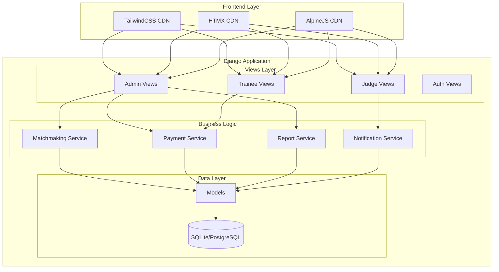
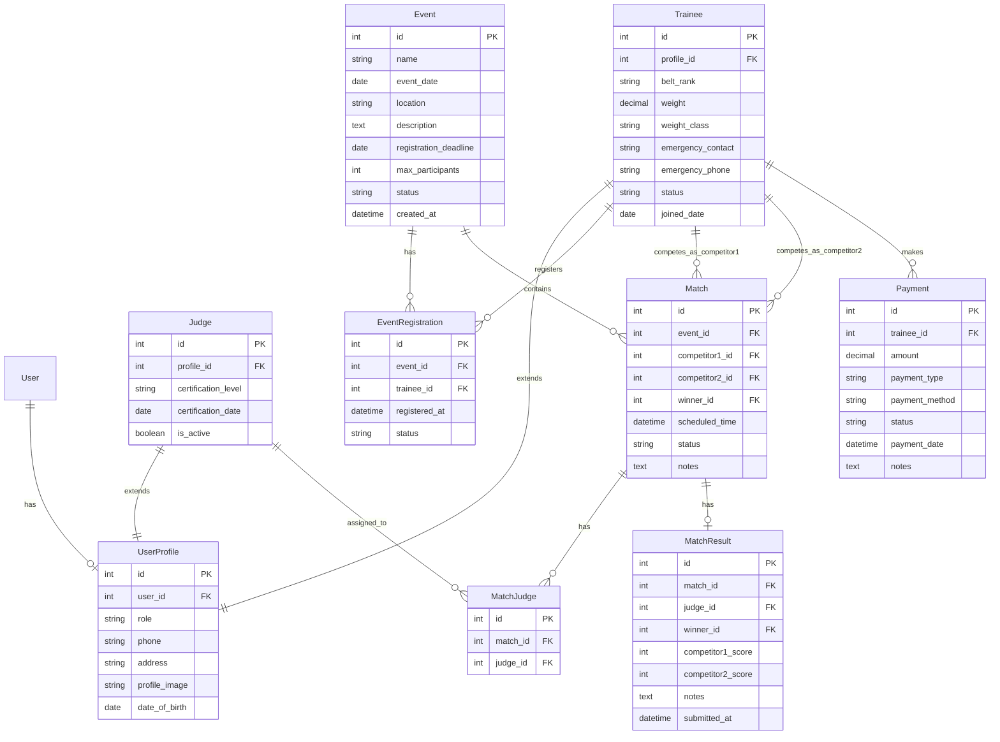

# Design Document: BlackCobra Karate Club System

## Overview

The BlackCobra Karate Club System is a Django-based web application providing role-based management for karate club operations. The system serves three user roles (Admin, Trainee, Judge) with dedicated dashboards and features. The frontend leverages TailwindCSS CDN for styling, HTMX CDN for dynamic interactions without JavaScript, and AlpineJS CDN for reactive UI components.

### Technology Stack
- **Backend**: Django 5.2+ with Python 3.12+
- **Database**: SQLite (development), PostgreSQL (production-ready)
- **Frontend**: TailwindCSS CDN, HTMX CDN, AlpineJS CDN
- **PDF Generation**: ReportLab (already in dependencies)
- **Image Handling**: Pillow (already in dependencies)

### Command Shortcuts
- `uvmm` - Make migrations (`uv run python manage.py makemigrations`)
- `uvm` - Migrate (`uv run python manage.py migrate`)
- `uvr` - Run server (`uv run python manage.py runserver`)

## Architecture



### URL Structure

```
/                           # Landing/Login page
/login/                     # Login
/logout/                    # Logout

/admin/dashboard/           # Admin dashboard
/admin/trainees/            # Trainee management
/admin/events/              # Event management
/admin/matchmaking/         # Matchmaking management
/admin/payments/            # Payment management
/admin/reports/             # Reports

/trainee/dashboard/         # Trainee dashboard
/trainee/events/            # Upcoming events
/trainee/matches/           # Schedule matches
/trainee/payments/          # Payment history

/judge/dashboard/           # Judge dashboard
/judge/events/              # Upcoming events
/judge/matches/             # Assigned matches
/judge/results/             # Results entry
```

## Components and Interfaces

### 1. Authentication Component

```python
# Decorators for role-based access
def admin_required(view_func):
    """Decorator ensuring user has admin role"""
    pass

def trainee_required(view_func):
    """Decorator ensuring user has trainee role"""
    pass

def judge_required(view_func):
    """Decorator ensuring user has judge role"""
    pass
```

### 2. Matchmaking Service Interface

```python
class MatchmakingService:
    def auto_match(self, event_id: int) -> list[ProposedMatch]:
        """
        Generate automatic match pairings for an event.
        Rules:
        - Weight class: within 5kg
        - Belt rank: same or adjacent
        - Age group: within 3 years
        Returns list of proposed matches for admin review.
        """
        pass
    
    def create_match(self, event_id: int, competitor1_id: int, 
                     competitor2_id: int, judge_ids: list[int],
                     scheduled_time: datetime) -> Match:
        """Create a manual match assignment"""
        pass
    
    def assign_judges(self, match_id: int, judge_ids: list[int]) -> bool:
        """Assign judges to a match, validating conflicts"""
        pass
```

### 3. Payment Service Interface

```python
class PaymentService:
    def record_payment(self, trainee_id: int, amount: Decimal,
                       payment_type: str, payment_method: str) -> Payment:
        """Record a new payment"""
        pass
    
    def get_trainee_payments(self, trainee_id: int) -> QuerySet[Payment]:
        """Get all payments for a trainee"""
        pass
    
    def get_pending_payments(self) -> QuerySet[Payment]:
        """Get all pending payments"""
        pass
    
    def mark_completed(self, payment_id: int) -> Payment:
        """Mark a payment as completed"""
        pass
```

### 4. Report Service Interface

```python
class ReportService:
    def membership_report(self, start_date: date, end_date: date) -> dict:
        """Generate membership statistics report"""
        pass
    
    def financial_report(self, start_date: date, end_date: date) -> dict:
        """Generate financial summary report"""
        pass
    
    def event_report(self, event_id: int) -> dict:
        """Generate event participation report"""
        pass
    
    def export_pdf(self, report_data: dict, report_type: str) -> bytes:
        """Export report as PDF"""
        pass
    
    def export_csv(self, report_data: dict, report_type: str) -> str:
        """Export report as CSV"""
        pass
```

### 5. HTMX Partial Views

```python
# Partial views for HTMX updates
def trainee_list_partial(request):
    """Returns HTML fragment for trainee list"""
    pass

def event_list_partial(request):
    """Returns HTML fragment for event list"""
    pass

def match_list_partial(request):
    """Returns HTML fragment for match list"""
    pass

def payment_list_partial(request):
    """Returns HTML fragment for payment list"""
    pass
```

## Data Models



### Model Definitions

```python
class UserProfile(models.Model):
    ROLE_CHOICES = [
        ('admin', 'Admin'),
        ('trainee', 'Trainee'),
        ('judge', 'Judge'),
    ]
    user = models.OneToOneField(User, on_delete=models.CASCADE)
    role = models.CharField(max_length=20, choices=ROLE_CHOICES)
    phone = models.CharField(max_length=20, blank=True)
    address = models.TextField(blank=True)
    profile_image = models.ImageField(upload_to='profiles/', blank=True)
    date_of_birth = models.DateField(null=True, blank=True)

class Trainee(models.Model):
    BELT_CHOICES = [
        ('white', 'White'),
        ('yellow', 'Yellow'),
        ('orange', 'Orange'),
        ('green', 'Green'),
        ('blue', 'Blue'),
        ('brown', 'Brown'),
        ('black', 'Black'),
    ]
    STATUS_CHOICES = [
        ('active', 'Active'),
        ('inactive', 'Inactive'),
        ('suspended', 'Suspended'),
    ]
    profile = models.OneToOneField(UserProfile, on_delete=models.CASCADE)
    belt_rank = models.CharField(max_length=20, choices=BELT_CHOICES)
    weight = models.DecimalField(max_digits=5, decimal_places=2)
    weight_class = models.CharField(max_length=20)  # Calculated from weight
    emergency_contact = models.CharField(max_length=100)
    emergency_phone = models.CharField(max_length=20)
    status = models.CharField(max_length=20, choices=STATUS_CHOICES, default='active')
    joined_date = models.DateField(auto_now_add=True)

class Event(models.Model):
    STATUS_CHOICES = [
        ('draft', 'Draft'),
        ('open', 'Open for Registration'),
        ('closed', 'Registration Closed'),
        ('ongoing', 'Ongoing'),
        ('completed', 'Completed'),
        ('cancelled', 'Cancelled'),
    ]
    name = models.CharField(max_length=200)
    event_date = models.DateField()
    location = models.CharField(max_length=200)
    description = models.TextField(blank=True)
    registration_deadline = models.DateField()
    max_participants = models.IntegerField()
    status = models.CharField(max_length=20, choices=STATUS_CHOICES, default='draft')
    created_at = models.DateTimeField(auto_now_add=True)

class Match(models.Model):
    STATUS_CHOICES = [
        ('scheduled', 'Scheduled'),
        ('ongoing', 'Ongoing'),
        ('completed', 'Completed'),
        ('cancelled', 'Cancelled'),
    ]
    event = models.ForeignKey(Event, on_delete=models.CASCADE)
    competitor1 = models.ForeignKey(Trainee, on_delete=models.CASCADE, related_name='matches_as_competitor1')
    competitor2 = models.ForeignKey(Trainee, on_delete=models.CASCADE, related_name='matches_as_competitor2')
    winner = models.ForeignKey(Trainee, on_delete=models.SET_NULL, null=True, blank=True, related_name='won_matches')
    scheduled_time = models.DateTimeField()
    status = models.CharField(max_length=20, choices=STATUS_CHOICES, default='scheduled')
    notes = models.TextField(blank=True)

class Payment(models.Model):
    TYPE_CHOICES = [
        ('membership', 'Membership Fee'),
        ('event', 'Event Fee'),
        ('equipment', 'Equipment'),
        ('other', 'Other'),
    ]
    STATUS_CHOICES = [
        ('pending', 'Pending'),
        ('completed', 'Completed'),
        ('overdue', 'Overdue'),
        ('cancelled', 'Cancelled'),
    ]
    trainee = models.ForeignKey(Trainee, on_delete=models.CASCADE)
    amount = models.DecimalField(max_digits=10, decimal_places=2)
    payment_type = models.CharField(max_length=20, choices=TYPE_CHOICES)
    payment_method = models.CharField(max_length=50)
    status = models.CharField(max_length=20, choices=STATUS_CHOICES, default='pending')
    payment_date = models.DateTimeField(auto_now_add=True)
    notes = models.TextField(blank=True)
```


## Correctness Properties

*A property is a characteristic or behavior that should hold true across all valid executions of a system-essentially, a formal statement about what the system should do. Properties serve as the bridge between human-readable specifications and machine-verifiable correctness guarantees.*

Based on the acceptance criteria analysis, the following correctness properties must be validated:

### Authentication & Authorization Properties

**Property 1: Role-based dashboard redirect**
*For any* authenticated user with a valid role, logging in SHALL redirect to the dashboard URL corresponding to their role (admin → /admin/dashboard/, trainee → /trainee/dashboard/, judge → /judge/dashboard/).
**Validates: Requirements 1.1**

**Property 2: Role-based navigation filtering**
*For any* authenticated user, the navigation items displayed SHALL contain only links appropriate to their assigned role.
**Validates: Requirements 1.3**

**Property 3: Protected route access control**
*For any* protected URL and unauthenticated request, the response SHALL be a redirect to the login page.
**Validates: Requirements 1.4**

### Data Integrity Properties

**Property 4: Trainee creation persistence**
*For any* valid trainee data submitted through the form, a Trainee record SHALL exist in the database with matching field values after submission.
**Validates: Requirements 3.3**

**Property 5: Event creation persistence**
*For any* valid event data submitted through the form, an Event record SHALL exist in the database with matching field values after submission.
**Validates: Requirements 4.3**

**Property 6: Payment creation and history update**
*For any* payment recorded for a trainee, the payment SHALL appear in that trainee's payment history query results.
**Validates: Requirements 6.3**

### Auto-Matchmaking Algorithm Properties

**Property 7: Auto-matchmaking weight constraint**
*For any* match generated by auto-matchmaking, the absolute weight difference between competitor1 and competitor2 SHALL be less than or equal to 5kg.
**Validates: Requirements 5.3**

**Property 8: Auto-matchmaking belt rank constraint**
*For any* match generated by auto-matchmaking, the belt ranks of competitor1 and competitor2 SHALL be the same or adjacent (e.g., white-yellow, green-blue).
**Validates: Requirements 5.3**

**Property 9: Auto-matchmaking age constraint**
*For any* match generated by auto-matchmaking, the absolute age difference between competitor1 and competitor2 SHALL be less than or equal to 3 years.
**Validates: Requirements 5.3**

**Property 10: Judge conflict validation**
*For any* judge assigned to a match, that judge SHALL NOT be a competitor in any match within the same event.
**Validates: Requirements 5.5**

### Business Rule Properties

**Property 11: Registration deadline enforcement**
*For any* event where the current date is after the registration deadline, registration attempts SHALL be rejected.
**Validates: Requirements 9.4**

**Property 12: Match result immutability**
*For any* match with a submitted result, subsequent result modification attempts (without admin override) SHALL be rejected.
**Validates: Requirements 14.4**

**Property 13: Search filter accuracy**
*For any* search query on the trainee list, all returned trainees SHALL contain the search term in at least one searchable field (name, belt rank, status).
**Validates: Requirements 3.6**

**Property 14: Payment status filter accuracy**
*For any* payment status filter applied, all returned payments SHALL have a status matching the filter value.
**Validates: Requirements 6.4**

**Property 15: Trainee-specific payment history**
*For any* trainee viewing their payment history, all displayed payments SHALL belong to that trainee only.
**Validates: Requirements 11.1**

**Property 16: Judge-specific match assignment**
*For any* judge viewing their assigned matches, all displayed matches SHALL have that judge in their MatchJudge assignments.
**Validates: Requirements 13.2**

## Error Handling

### Authentication Errors
- Invalid credentials: Display error message, remain on login page
- Session expired: Redirect to login with "session expired" message
- Unauthorized access: Redirect to login or display 403 page

### Form Validation Errors
- Missing required fields: Highlight fields, display inline error messages
- Invalid data format: Display specific format requirements
- Duplicate entries: Display conflict message with existing record reference

### Business Logic Errors
- Registration closed: Display "Registration deadline passed" message
- Judge conflict: Display "Judge cannot be assigned - competing in event" message
- Auto-matchmaking insufficient participants: Display "Not enough eligible participants" message

### System Errors
- Database connection failure: Display generic error page, log details
- File upload failure: Display "Upload failed" message with retry option

## Testing Strategy

### Property-Based Testing Framework
- **Library**: Hypothesis (Python property-based testing library)
- **Minimum iterations**: 100 per property test
- **Test annotation format**: `# **Feature: blackcobra-karate-club, Property {number}: {property_text}**`

### Unit Testing
- Test individual model methods and validations
- Test service layer business logic
- Test view response codes and redirects
- Test form validation

### Integration Testing
- Test complete user flows (login → action → logout)
- Test HTMX partial updates
- Test role-based access across all protected routes

### Test Organization
```
core/
├── tests/
│   ├── __init__.py
│   ├── test_models.py          # Model unit tests
│   ├── test_views.py           # View unit tests
│   ├── test_services.py        # Service layer tests
│   ├── test_properties.py      # Property-based tests
│   └── test_integration.py     # Integration tests
```

### Key Test Scenarios
1. Authentication flow with all three roles
2. Auto-matchmaking with various participant combinations
3. Payment recording and history retrieval
4. Event registration with deadline validation
5. Match result submission and immutability
6. Search and filter functionality across all list views
